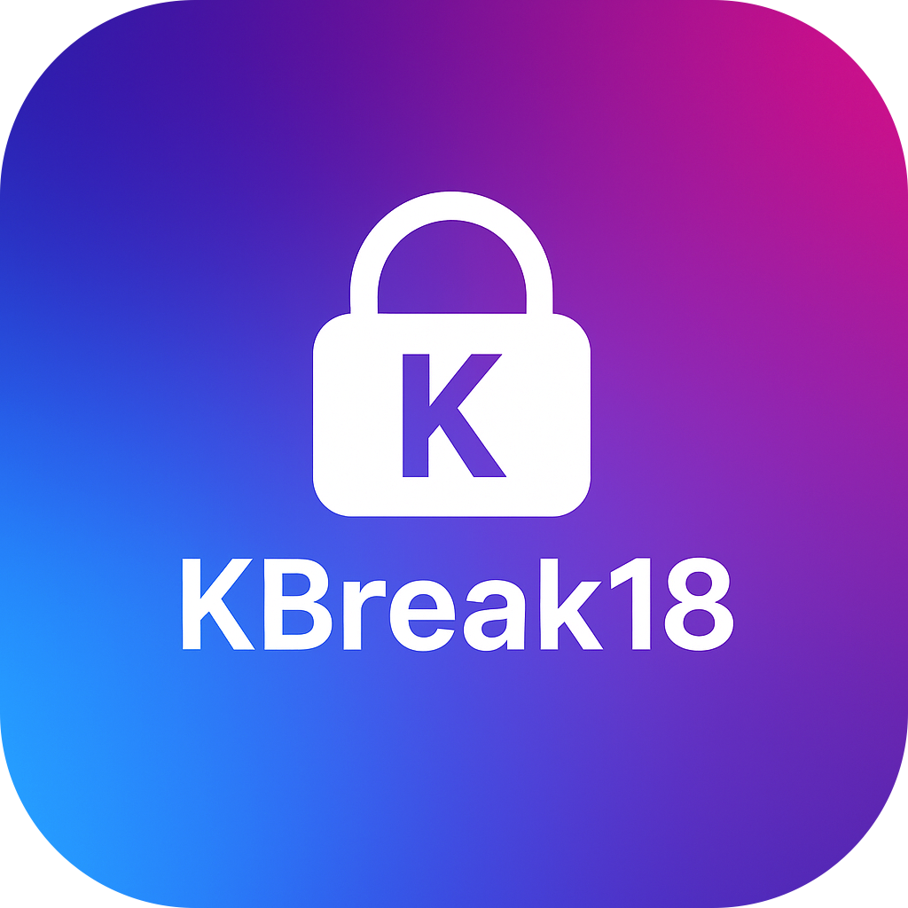

# KBreak18

**KBreak18** is a **rootless semi-untethered jailbreak** for:

- **iOS 18.0 – 18.3** *(possibly up to 18.5)* on `arm64e` devices  

More technical details and release builds will follow soon.

---

### ✅ Recommended for older iOS versions:
For **iOS 15 – 16**, we recommend using **[Dopamine](https://github.com/opa334/Dopamine)** by opa334.

---

### 🔧 Tweak Injection
KBreak18 uses **[ElleKit](https://github.com/opa334/ellekit)** for modern, PAC-safe tweak injection.

---

### ⚠️ Issues
Please note:  
❗ All GitHub issues related to version support (unsupported versions, betas, etc.) will be **closed without response**.
 And the jailbreak is not finished yet, this means that it wont even jailbreak yet, so **Dont Try to Jailbreak or use this tool**
---

## ✅ Supported Devices & Versions

### 🔒 `arm64e` (PAC enabled)

| Device                      | Max Supported Version |
|-----------------------------|------------------------|
| iPhone XS / XS Max / XR     | iOS 18.3 (maybe 18.5)  |
| iPhone 11 / 11 Pro / Pro Max| iOS 18.3 (maybe 18.5)  |
| iPhone SE (2nd & 3rd Gen)   | iOS 18.3 (maybe 18.5)  |
| **iPhone 13**               | 🚧 *To be tested - iOS 18.5* |
| iPhone 14 / 15 Series       | iOS 18.3 (maybe 18.5)   |

---

## 🌐 Official Website / Download

Coming soon.
